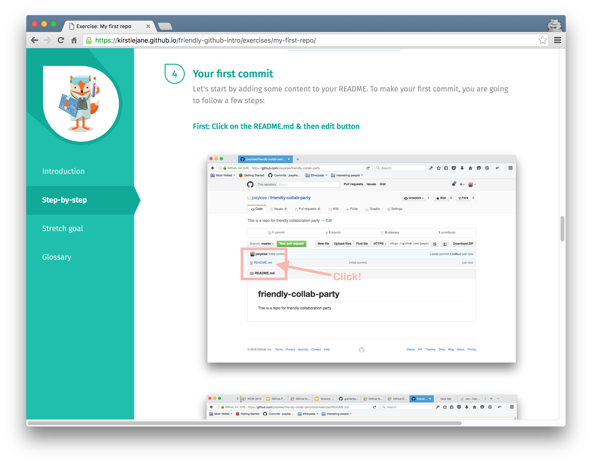

# A Friendly Github Intro Workshop

## Post-It / Ice-Breaker

- 1) What do you do as version control at the moment?
- 2) What would you like to learn about Git and Github?

----


- "Piled Higher and Deeper" by Jorge Chan,
http://www.phdcomics.com

----

# Thanks to Mozilla Science


- Many thanks to *Mozilla Science Lab* for sharing with  us this training material
- Thanks to Joey and Steph who ran this workshop in Vancouver in March 2016

----

# Hi!

With you today...

----

# Code of conduct

- https://science.mozilla.org/code-of-conduct

- The Mozilla Science Lab is dedicated to providing a harassment-free learning experience for everyone, regardless of gender, sexual orientation, disability, physical appearance, body size, race, religion, or choice of text editor. We do not tolerate harassment of participants in any form.
- All communication should be appropriate for a professional audience including people of many different backgrounds. Sexual language and imagery is not appropriate for any event.
- Be kind to others. Do not insult or put down other attendees.
- Behave professionally. Remember that harassment and sexist, racist, or exclusionary jokes are not appropriate.
- Attendees violating these rules may be asked to leave the event at the sole discretion of the conference organizers without a refund of any charge that may have been levied.
- Thank you for helping make this a welcoming, friendly event for all.

----

# Learning Objectives

- Explain what is version control 
- Recall why version control is crucial for research and not just for programmers
- Tell the differences between Git and GitHub
- Create your first GitHub project
- Explain and use the different GitHub commands
- Use GitHub to collaborate and share your projects with others
- Experiment with GitHub Desktop and set up a local project to sync to GitHub

----

# Workshop schedule

- 13:20 Presentation "Introduction to version control with git and github"
  + Exercise 1. Setup your first project
- 14:00 15min break
- 14:15 Presentation "Working collaboratively with github"
  + Exercise 2: Your first pull request
- 14:45 Presentation: "Working locally using git
  + Exercise 3: Sync your GitHub repository to your laptop
- 15:45 Presentation: More things you can do with github
- 16:00 Free time and questions

---

# Github: What, why & Welcome

----

# Learning Objectives

- Explain what is version control
- Recall why version control is crucial for researchers and *not just for programmers*
- Tell the differences between Git and Github
- Create your first GitHub project

----

# Version Control

Management of *changes*, called *revisions* to any types of information

- Simple file versioning
  + add v1.0, v1.1,...to file names
- Simple tools
  + Google Drive, Dropbox
- Advanced tools
   + subversion and git
   
----
 
 # Management of changes
 
 - Revision
  + Associated with a *timestamp* and the *person* making the change
  + Compared, restored, and with certain types of file merged
- Main Benefits
  + Go back to previous versions
  + Store history of changes
  + Collaborate with others
  
----

# GitHub is an online service

- hosts your repositories (projects)
- helps you work with contributors / collaborators
- web interface for version control

----

# Interfaces to GitHub

- directly online
- with the Github Desktop App
- via the command line using 'git'
- via RStudio for R fans

----

# Examples of GitHub magic


- http://stat545.com/ 
- http://katiekowalsky.me/portfolio/
- http://rik.smith-unna.com/phd/thesis.html
- http://mozillascience.github.io/leadership-training/
- http://population.io/

----

# Our GitHub project


----

# Sign-in


----

# Exercise: My first Repo


----

# Congratulations! :tada:

- Know what is version control and GitHub
- Know the difference between Git and GitHub
- Created a new repository

----

# Learning Objectives

- Explain the difference between Git / GitHub terms
- Use these commands online in GitHub

----

# Git/GitHub Terms (1)

- *Repository*
  + a project where all your files are, online or on your own computer
- *Commit*
  + saving a version of file(s)
  ```
  > git add README.md
  > git commit -m "My first commit"
  ```
- *Issues*
  + to-do list of tasks, bugs and things you wish to accomplish
  
----

# Git/GitHub Terms (2)

- *Branch*
  + copy of your project


----

# Git/GitHub Terms (2)


- *Pull request*
  + request to add your changes from a branch back into the *master*
- *Merge*
  + act of incorporating new changes (commits) from one branch to another

----

# Exercise: My first repo



----

# Exercise: My first repo

- Steps 4 to end
  + Commit
  - Issue
  - Branch
  - Pull Request
  - Merge
  
----

# Git / GitHub Terms (3)

- Fork
  + make a copy of someone else's repository
  


----

# Git / GitHub Terms (3)

- Pull request
  + request to add your changes into a *forked* repository
- Clone
  + copy a repository onto your local computer
- Download zip
  + download the content of a repository
  
----


----

# Glossary & Questions

- Don’t worry if you haven’t gotten all the terms yet
  + we’ll give you time to play more and clarify any questions. 

---

# Collaborating with GitHub

----

# Workflow #1 - Add Collaborators

- As the owner of a repo you:
  + add people as collaborators 
  + each collaborator can read/write files in the repo 
  + each collaborator is adding files and other content; making branches and either directly merging changes in or via pull requests

----


----


----


----

# Why and When would I add collaborators?

- You’re building a website and you have a team of trusted teammates.
- You’re writing a paper and multiple people will be writing and editing.
- You’re developing a new course and multiple people are developing content.
- You are doing an analysis and need your collaborator to do a code review.
- etc...

----

# *You add collaborators when they are a core part of your team! *

----

# Workflow #2 - Fork + Pull Request

- If you don’t own a repo and aren’t an official collaborator:
  + you will fork a repo - mmm yummy
  + work on your forked copy of the repo 
  + in order to get your changes pulled into the original repo ; make a pull request for the changes you’ve made
  + the author/owner of the original repo will determine if your changes are cool; and merge them in.
  + Make friends = Big party! 

----


----


----


----

# GitHub and Markdown

----

Markdown is a simple text “markup” language made for quickly writing formatted text - great for blogging, documentation, and even writing papers. If you can make an emoji, you can write markdown! 


----

Markdown is important because GitHub automatically renders anything written in Markdown. This can be specific files (eg: README), or your comments on pull requests and issues.

Some useful resources:
https://github.com/adam-p/markdown-here/wiki/Markdown-Cheatsheet
https://www.webpagefx.com/tools/emoji-cheat-sheet 

----

# Exercise: My First Pull Request

Work in pairs to edit a file in your partner's GitHub repository using a pull request. (And vice versa.)

---

# GitHub Desktop Essentials

----

# Desktop Essentials

- Need files on your local computer (or compute cluster)
  + Edit using local tools
  + Run software on your machine
  + Synchronise among several computers via GitHub
- GitHub Desktop provides GUI
- Git provides command line (no GUI on Linux)

----

# GitHub, your repo, your working files


----

# Install GitHub Desktop locally (Mac, Windows)


----

# Get Atom to edit your files locally


----

# Changes Timeline


----

# Add, Create, Clone rep


----

# Branches

- When opening the repo folder on your computer, it opens it with the branch showed in GitHub Desktop


----

# Using the command line

```
> git clone repo

> git status
> git add changed_file
> git commit -m "Commit message"
> git push
```

----

# Using the command line

```
> git checkout -b cmd-line-branch
> git branch
> git push origin cmd-line-branch

> git checkout master
> git branch
> git merge cmd-line-branch
> git push

> git log
> git revert commit_id
> git push

```

----

# Example workflow

- Clone a repo from GitHub
- Commit and publish a change
- Create a branch
- Merge changes to master branch
- Revert a commit

----

# Clone repo


- Choose the repository you want to copy to your local computer
- Click *Clone*
- Choose a location on your local computer

----

# Commit and publish a change


- Add your changes to your repo locally
- Write a helpful message
- Commit and Sync

----

# Commit and push


```
> git status
> git add README.md
> git commit -m "Add README file"
> git push

```

----

# Commit and publish


- Create a branch
- Add your changes to your repo locally
  + you are now working in your newly-created branch!
- Commit and publish

----

```
> git checkout -b cmd-line-branch
> git branch
> git push origin cmd-line-branch
```

----

# Compare, Update and Sync


- Merge changes to master branch
- Compare
- Select the branch and Update and Sync

----

```
> git checkout master
> git branch
> git merge cmd-line-branch
> git push
```

----

# Revert


- Go to history
- Select the commit you wish to revert
- Revert it!

----

```
> git log
> git revert a45fbb326d83acb42f6521c6fed2cb5c0e8a3018
> git push
```
----

# Exercise: Working Locally


---

# Moar things you can do with GitHub

----

# Lead your own open source project

These special files are really useful for new contributors:

- README
- CONTRIBUTING
- CODE OF CONDUCT
- LICENSE

----

# README


----

# The almighty README


It is a file (*.md*) with text in it that describes

- what you're doing, for who, and why
- what makes your project special and exciting
- how to get started
- where to find key resources

-----

# CONTRIBUTING

in your root directory, all caps, in markdown


- location
- cheer
- how-to
- style
- Link appears when you contribute to a project

----

# CODE OF CONDUCT

code of conduct (n).
> a set of rules outlining the social norms and rules and responsibilities of an individual project, party of organization

----

# Why is it needed?


----

# Why is it needed?


----

# Getting started

- Describe core words; these could be values, ideals or characteristics of people you want to be associated to your community
- Behaviours to encourage? Discourage?
- Process of bringing issues to the table
- Consequences of breaking the code
- Understanding your role

----

# LICENSE

in your root directory, all caps, in markdown

- *sharing your project* online isn't everything
- it's important to tell people *how they can use* that project
- choosing an open source license can be confusing
- Some folks created [ChooseALicense.com](http://ChooseALicense.com) to help you make that decision

----

# Don't want to license?

- You're under no obligation to choose a license
- It's your right not to include one with your code or project...
- Generally speaking, the absence of a license means that the default copyright laws apply
- This means that you retain all rights to your source code and that *nobody else may reproduce, distribute, or create derivative works from your work*. This might not be what you intend

----

# Host a website


 GitHub is able to host a special website for you
 
 - [https://datachampcam.github.io/friendly-github-intro/](https://datachampcam.github.io/friendly-github-intro/)
 - https://[yourGitHubName].github.io/[YourRepo]
 
 You're hosting the webpage through your fork!
 
----
 
 # Settings
 
 
 
 - Click *settings* tab to setup the webpage
 - The homepage will be your *README.md* file
  + it gets rendered to HTML on the fly
  + no need to write HTML code, only markdown!
 
----
 
 # Private Repositories
 
 
 
[https://education.github.com/](https://education.github.com/) to request unlimited private repositories for academic use
 
----
 
 # Thank you!
 
 ----
